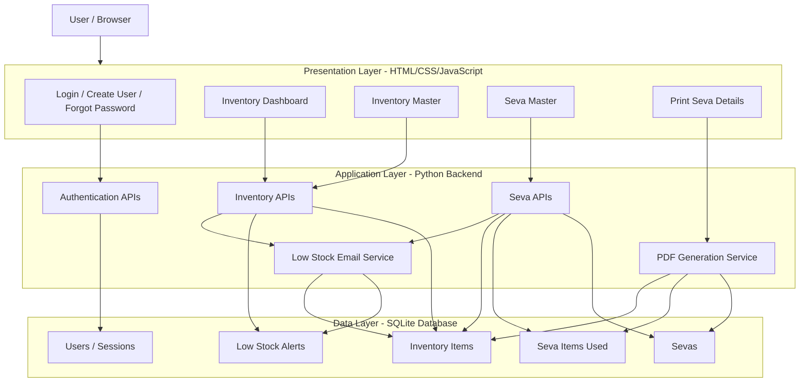

# InventoryTracker

Inventory Tracking app which allows manual and automatic updating based on seva descriptions.

## Inventory Master

A dependency-free three-tier inventory management application:

- **Presentation tier:** responsive HTML, CSS, and JavaScript interface
- **Application tier:** Python HTTP and JSON API
- **Data tier:** SQLite database (`inventory.db`, created automatically)

## Architecture



## Run

```bash
python3 app.py
```

Open <http://127.0.0.1:8000> in a browser. Stop the server with `Ctrl+C`.

## Features

- Login page with email-based user IDs, create-user option, and forgot-password reset link
- Password visibility toggle
- User credentials stored locally in SQLite with password hashing
- Create, edit, search, filter, and delete inventory master records with required units
- Bulk-correct inventory stock and minimum threshold values
- Record sevas and subtract used quantities from inventory stock
- View a read-only log of past sevas, dates, and items used
- Edit or delete past sevas while automatically restoring/adjusting inventory
- Manage sevas from a single Seva master panel with Breakfast/Lunch type and people-served count tracking
- Add seva inventory usage by selecting items from inventory dropdowns
- Stock status and reorder alerts
- Restock email notification support for items needing attention
- Persistent local SQLite storage

## Email notifications

Restock emails are sent to `communitysevainventory@gmail.com` when an item newly enters the needs-attention state.

Create a local `.env` file in the project folder:

```text
SMTP_HOST=smtp.gmail.com
SMTP_PORT=587
SMTP_USER=communitysevainventory@gmail.com
SMTP_PASSWORD=your-gmail-app-password
SMTP_FROM=communitysevainventory@gmail.com
```

You can copy `.env.example` to `.env` and replace `your-gmail-app-password`.

For Gmail, use an app password rather than the normal account password.

The `.env` file is ignored by Git so the app password does not get committed.

To test only the email settings, run:

```bash
python3 test_email.py
```

## API

- `POST /api/users`
- `POST /api/login`
- `POST /api/logout`
- `GET /api/sevas`
- `POST /api/sevas`
- `GET /api/items` (supports `search` and `status` query parameters)
- `POST /api/items`
- `PUT /api/items/{id}`
- `DELETE /api/items/{id}`
